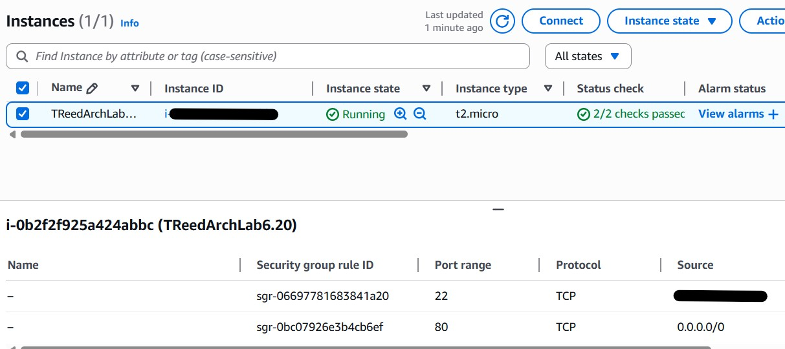
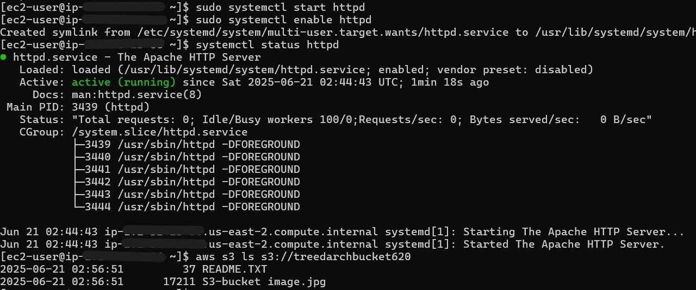
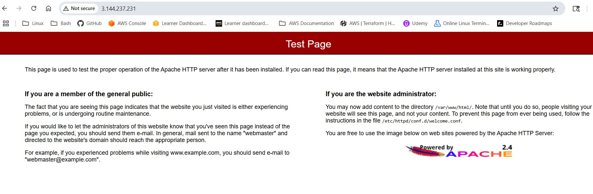

# cloud-admin-ec2-s3-lab-6-20
AWS EC2 + S3 + CloudWatch + IAM lab for Cloud Admin study

# Cloud Admin Lab 6-20: EC2 + S3 + IAM + CloudWatch

## Overview
This lab demonstrates a basic AWS architecture:
- EC2 instance (Amazon Linux 2) running Apache web server
- S3 bucket for storing assets
- IAM role with least-privilege S3 access
- CloudWatch alarm for CPU utilization > 50% with SNS email alert

## Steps
1. Launched EC2 instance `TReedArchLab6.20` with:
   - Apache installed and configured
   - SSH restricted to my IP
   - HTTP open to 0.0.0.0/0 for testing
   - 
##Images

2. Created S3 bucket `treedarchbucket620`
   - Uploaded image and README.txt
   - Public access blocked
   - Used EC2 IAM role to list/copy objects

3. IAM
   - Created IAM policy `TreedArchPolicy620` with S3 list/get permissions
   - Attached policy to `TreedArchRole620` and linked to EC2

4. CloudWatch
   - Configured alarm on CPU utilization > 50%
   - Used `yes > /dev/null &` to trigger alarm
   - Verified email alert via SNS

## Files
- `index.html` — Web page content
- `TreedArchPolicy620.json` — IAM policy
- `screenshots/` — Evidence of setup (EC2 console, S3, CloudWatch alarm, email)

## What I Learned
- Setting up secure EC2 + S3 architecture
- IAM role + policy design for EC2-S3 access
- Configuring CloudWatch and SNS for proactive alerting
- How to cleanly document AWS lab work in GitHub
